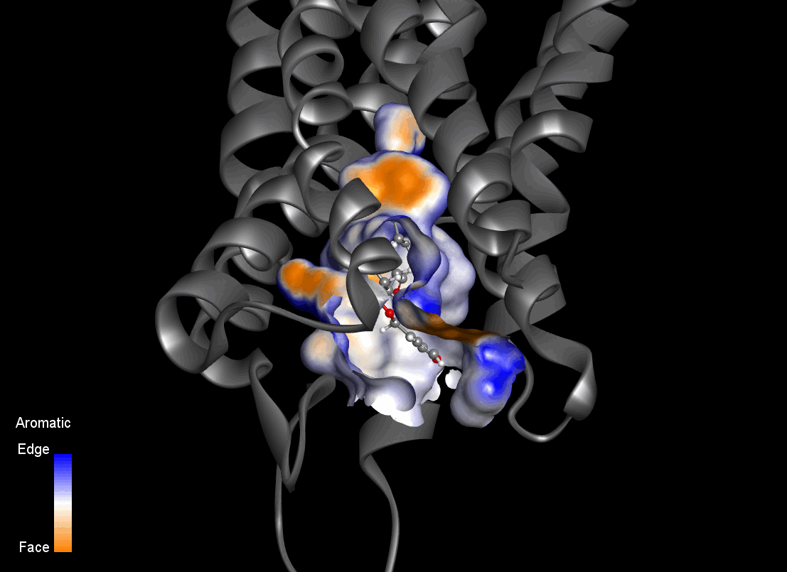

# KOR-proof-of-concept  
**Exploratory Computational Study of Salvinorin A Binding to the Kappa Opioid Receptor**

This repository contains supporting material for my application as a PhD candidate to the **International Max Planck Research School for Biology and Computation (IMPRS-BAC)**, within the project  
*“Computational Design of Tailored Kappa Opioid Receptor (KOR) Modulators”*.

The contents presented here consist of **exploratory computational analyses and proof-of-concept studies** conducted to assess the feasibility of **molecular dynamics–guided approaches** for the investigation and rational design of novel KOR ligands.

Animated visualizations are provided to illustrate **exploratory binding hypotheses and dynamic pocket inspection** derived from molecular dynamics simulations. These initial animations are intended for **qualitative assessment only**.

Further methodological refinement, quantitative validation, and experimental integration are anticipated as part of the proposed doctoral research.

---

## Key visual results

### Spatiotemporal pocket fields (GIFs)
- **Hydrophobicity, aromaticity, interpolated charge, hydrogen bonding, solvent-accessible surface (SAS), and ionizability** (examples)

  

  <em>Figure 1 - Dynamic aromaticity fingerprint profile in the binding site of the KOR–SalA complex.</em>

Six sonar-like dynamic pocket field maps were generated from the first **29 frames** of an **exploratory 100 ns molecular dynamics simulation**, using a **fixed spatial grid** defined in Discovery Studio.

An important observation is that the **same spatial grid** can be used to represent different **physicochemical properties**, with only the scalar field values changing across channels.

The integration of these multi-channel spatiotemporal descriptors — together with data obtained from additional KOR–SalA complexes — provides a conceptual basis for **machine learning–assisted extraction of interaction patterns and design rules**, potentially guiding scaffold exploration and optimization toward KOR selectivity.

While the animations shown in Figure 1-6 are visual representations, the underlying data can, in principle, be extracted in numerical form for downstream analysis.

  

  <em>Chemical structures of representative ligands to be investigated in the project.</em>

---

### Simulation status

The preliminary molecular dynamics simulations are currently ongoing.  
The analyses and results presented here correspond to **partial trajectories (29 ns)** obtained from a planned **200 ns production run**.
