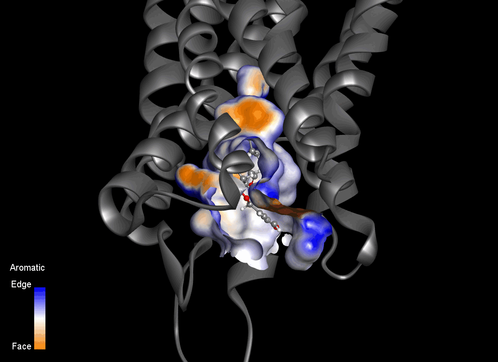

# KOR-proof-of-concept
**Exploratory Computational Study of Salvinorin A Binding to the Kappa Opioid Receptor**

This repository contains supporting material for my application as a PhD candidate to the International Max Planck Research School for Biology and Computation (IMPRS-BAC), within the project *“Computational Design of Tailored Kappa Opioid Receptor (KOR) Modulators”*.

The contents presented here consist of exploratory computational analyses and proof-of-concept studies conducted to assess the feasibility of molecular dynamics-guided approaches for the investigation and rational design of novel KOR ligands.

Animated visualizations are provided to illustrate exploratory inspection of dynamic binding pocket properties derived from molecular dynamics (MD) simulations. These initial animations are intended for **qualitative assessment only**.

Further methodological refinement, quantitative validation, and experimental integration would be anticipated as part of the proposed doctoral research.

---

## Key visual results

### Spatiotemporal pocket fields

Six dynamic pocket fields were obtained from an exploratory MD simulation of the KOR–SalA complex, using a fixed spatial grid defined in Discovery Studio 2024: **aromaticity**, **hydrogen bonding**, **interpolated charge**, **hydrophobicity**, **ionizability**, and **solvent-accessible surface area (SASA)**.

<em>Figure 1 - Aromaticity dynamic profile in the binding site of the KOR–SalA complex.</em>

An important observation is that the same spatial grid can be used to represent different physicochemical properties, with only the scalar field values changing across channels throughout the trajectories.

The integration of multi-channel spatiotemporal descriptors (combined with data obtained from additional KOR complexes; proposed ligands seen in Figure 3) would provide dynamic fingerprinting data for **machine learning-assisted extraction of interaction patterns**, potentially guiding design rules for scaffold exploration and optimization toward KOR selectivity.

While the animations shown in Figures 1 and 2 are visual representations, the underlying data could be extracted in numerical form.

<em>Figure 2 - Hydrogen bonding dynamic profile of the KOR–SalA complex.</em>

The complete collection of spatiotemporal pocket field visualizations is available here: [`results/pocket_fields.md`](https://github.com/guilhermepinheirodasilva/KOR-proof-of-concept/blob/main/results/pocket_sonar_fields.md)

<em>Figure 3 - Chemical structures of representative ligands to be investigated in the project.</em>

The SalB metabolite (compound 4), although structurally highly similar to Salvinorin A, is inactive at KOR. Its inclusion in the analysis provides a chemically meaningful negative reference, enabling the identification of interaction field features that are necessary but not sufficient on their own for receptor modulation. Comparing the spatiotemporal interaction fields of SalA and SalB may therefore help refine subtle physicochemical determinants underlying KOR activation and selectivity, offering valuable constraints for scaffold hopping strategies.

Furthermore, evaluating KOR-selective ligands structurally unrelated to SalA (e.g., compounds 6, 7, and 8) would allow assessment of whether these interaction field patterns generalize across distinct chemical scaffolds, a key requirement for robust scaffold hopping.

---

### Simulation status and information

The preliminary molecular dynamics simulations are currently still ongoing.

The Salvinorin A structure was obtained from the Automated Topology Builder (ATB) and Repository. 
KOR structure was retrieved from Protein Data Bank (PDB ID 6B73).

The KOR–SalA complex was generated using AutoDock Vina, and the molecular dynamics simulation was performed with GROMACS.
