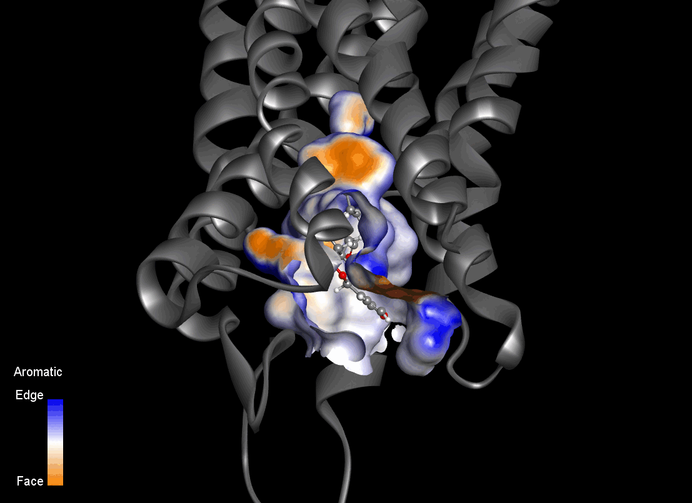

# KOR-proof-of-concept  
**Exploratory Computational Study of Salvinorin A Binding to the Kappa Opioid Receptor**

This repository contains supporting material for my application as a PhD candidate to the **International Max Planck Research School for Biology and Computation (IMPRS-BAC)**, within the project  
*“Computational Design of Tailored Kappa Opioid Receptor (KOR) Modulators”*.

The contents presented here consist of exploratory computational analyses and proof-of-concept studies conducted to assess the feasibility of molecular dynamics-guided approaches for the investigation and rational design of novel KOR ligands.

Animated visualizations are provided to illustrate exploratory inspection of dynamic binding pocket properties derived from molecular dynamics (MD) simulations. These initial animations are intended for **qualitative assessment only**.

Further methodological refinement, quantitative validation, and experimental integration would be anticipated as part of the proposed doctoral research.

---

## Key visual results

### Spatiotemporal pocket fields
- **Hydrophobicity, aromaticity, interpolated charge, hydrogen bonding, solvent-accessible surface (SASA), and ionizability**.

  

  <em>Figure 1 - Dynamic aromaticity fingerprint profile in the binding site of the KOR–SalA complex.</em>

Six dynamic pocket field maps were obtained from an exploratory MD simulation of the KOR–SalA complex, using a fixed spatial grid defined in Discovery Studio 2024.

An important observation is that the same spatial grid can be used to represent different physicochemical properties, with only the scalar field values changing across channels throughout the trajectories.

The integration of multi-channel spatiotemporal descriptors (combined with data obtained from additional KOR complexes; proposed ligands seen in Figure 7) would provide dynamic fingerprinting data for **machine learning-assisted extraction of interaction patterns**, potentially guiding design rules for scaffold exploration and optimization toward KOR selectivity.

While the animations shown in Figures 1–6 are visual representations, the underlying data could be extracted in numerical form.

  

  <em>Figure 7 - Chemical structures of representative ligands to be investigated in the project.</em>

---

### Simulation status and information
The preliminary molecular dynamics simulations are currently ongoing.  

The analyses and results presented correspond to partial trajectories (29 ns) obtained from a planned 200 ns production run.

Salvinorin A structure was obtained from Automated Topology Builder (ATB) and Repository. KOR structure was retrieved from Protein Data Bank (PBD ID 6B73).

The KOR–SalA complex was obtained using AutoDock Vina, and the molecular dynamics simulation was performed with GROMACS.
